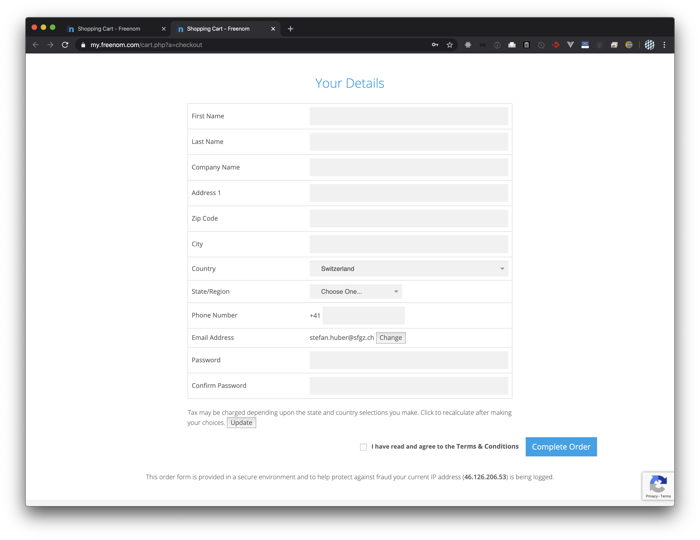
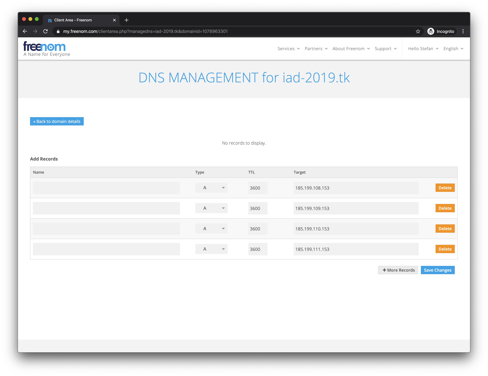

<header>

# {{process.content.frontmatter.title}}

</header>

## Ablauf

### Freenom
→ [freenom.com](https://www.freenom.com/) öffnen

→ Wunschdomain mit .tk-Endung eingeben

→  Checkout (oben rechts) wählen

→ «Forward this Domain» (beliebige URL eingeben)

→ 12 Monate einstellen
→ Verify via Mail

→ Link in Mail klicken (kann einige Minuten dauern)

→ Anmeldung ausfüllen & Login

→ Unter «My Domains»

→ «Manage Domain»

→ Management Tools  
→ Use default nameservers (Freenom Nameservers)

→ Manage Freenom DNS  
→ IP in DNS eintragen
  * 185.199.108.153
  * 185.199.109.153
  * 185.199.110.153
  * 185.199.111.153

### Github

→ Auf Github im Repository  
→ Settings  

→ Scroll bis «Custom domain»    
→ Domain Eintragen

